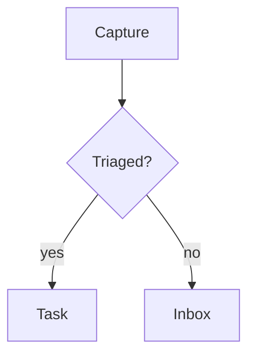

# nous-diagrams

> Authoring live diagrams and animations in Nous pages via the `mcp__nous__*` tools.

## Overview

Nous pages render two kinds of live graphics. Both are authored as **fenced code blocks in
markdown**, which matters because every MCP page-write tool (`create_page`, `append_to_page`,
`replace_block`, `insert_after_block`) accepts markdown only — a fence is the entire authoring
surface you have.

| You want | Fence | Good for |
|---|---|---|
| A diagram from a text description | ` ```mermaid ` | flowcharts, sequence, ER, gantt, state |
| A moving or drawn graphic you control | ` ```animation ` | canvas/SVG/JS, simulations, custom charts |

Reach for **mermaid first** — it's shorter, themes itself, and survives editing. Reach for
**animation** when the thing genuinely moves, or when the drawing isn't a graph Mermaid knows.

## Mermaid

Write a normal fence. It becomes a live diagram in the editor and on published pages.

````markdown

````

That's the whole contract. Source stays editable, and it round-trips through markdown export.

## Animation

The body of an ` ```animation ` fence is **a document body** — markup plus inline `<script>` and
`<style>`. It runs inside a null-origin sandboxed iframe.

````markdown
```animation
<canvas id="c" width="640" height="360" style="width:100%;height:100%;display:block"></canvas>
<script>
  const g = document.getElementById('c').getContext('2d');
  const css = getComputedStyle(document.documentElement);
  const reduce = matchMedia('(prefers-reduced-motion: reduce)').matches;
  let x = 60, vx = 3;
  function frame() {
    g.clearRect(0, 0, 640, 360);
    g.beginPath();
    g.arc(x, 180, 28, 0, Math.PI * 2);
    g.fillStyle = css.getPropertyValue('--accent').trim();
    g.fill();
    if (!reduce) { x += vx; if (x < 28 || x > 612) vx *= -1; requestAnimationFrame(frame); }
  }
  frame();
</script>
```
````

### The five rules

**1. Self-contained — nothing external.** The frame's CSP is
`default-src 'none'; connect-src 'none'`, so `fetch`, XHR, WebSocket, CDN scripts, external
stylesheets, remote images and webfonts all fail. Inline everything; `data:`/`blob:` URIs are
allowed for `img`, `media`, and fonts. No `import` — no module graph exists.

**2. Theme with the page palette.** These custom properties are injected into the frame:

`--bg` `--text` `--accent` `--panel` `--code-bg` `--callout-bg` `--muted` `--border`

Use `var(--accent)` in CSS, or `getComputedStyle(document.documentElement).getPropertyValue('--accent')`
in canvas code. Hard-coded colors will clash in one of the two themes — the palette is the whole
reason the graphic looks like it belongs on the page.

**3. Canvas authors must repaint on theme change.** CSS `var()` re-evaluates itself when the theme
flips; a canvas already painted does not. The frame fires an event for exactly this:

```js
addEventListener('nous-themechange', () => {
  // re-read the palette and redraw — the values have changed
  draw();
});
```

Skip this and your animation keeps the old theme's colors after the reader hits the toggle.

**4. Honor `prefers-reduced-motion: reduce`.** Draw a meaningful static frame instead of animating —
don't just stop the loop on a blank canvas. In CSS:
`@media (prefers-reduced-motion: reduce) { .thing { animation: none; } }`

**5. Size via the fence's default box.** A fence-authored animation gets the default 16/9 aspect;
`aspect` and `poster` are block properties that a fence can't carry (set them by hand in the editor
if needed). Make the graphic fill its box — `width:100%;height:100%`.

### What the sandbox means for you

The frame has a **unique opaque origin** (`sandbox="allow-scripts"`, deliberately without
`allow-same-origin`). Your code cannot touch the parent DOM, `localStorage`, cookies, or Tauri
`invoke` — attempts throw `SecurityError`. This is the Claude-artifacts isolation model. Don't try
to reach out; design the animation as a closed world.

The iframe also **lazy-mounts on scroll**, so an offscreen animation isn't running. If you're
verifying one in a browser and see no iframe, scroll it into view before concluding it's broken.

## Publishing across themes

All five export themes (`academic`, `minimal`, `documentation`, `blog`, `docs`) render both blocks:
a diagram publishes as a live, page-themed SVG and an animation runs with its theme bridge and
reduced-motion poster. Diagrams follow each theme's palette — light on the light-only themes
(`minimal`/`documentation`/`blog`), light or dark on `academic`/`docs` per the reader's toggle.

Animations follow the page palette too: the frame is null-origin and can't read the page's
tokens, so the parent bridge pushes the resolved token *values* into the frame (on load and on
every theme toggle) and the frame applies them as inline custom properties. `var(--accent)` and
`getPropertyValue('--accent')` therefore resolve to the page's real colors on every theme — on
`blog`, an animation's accent is the same blue as the page chrome. The inlined academic palette
remains only as a fallback when no push arrives.

## Worked examples

`~/Projects/erewhon/nous/src/plugin-sdk/blocks/animationTemplates.ts` holds four complete,
correct templates — bouncing shapes, analog clock, constellation, spinner ring. Each is palette-aware,
reduced-motion-aware and dependency-free. Read them before writing a new animation from scratch; the
canvas ones show the `getPropertyValue` palette pattern and the spinner shows the CSS `var()` one.

## Under the hood (for debugging)

An MCP-written fence lands on disk as `{type:"code", data:{language:"animation", code:"…"}}`. Two
converters promote it to a live block: `src/utils/blockFormatConverter.ts` (editor) and
`src-tauri/src/publish/html.rs` (published output). A native block created in the editor UI instead
stores its source in `data.html` — both forms are read by `animation_source()` in the Rust path.
Markdown export re-emits the fence, so the round-trip is closed.
